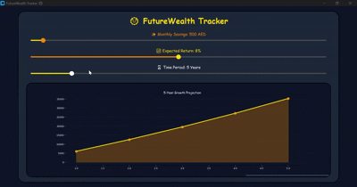

#  FutureWealth Tracker

**FutureWealth Tracker** is an interactive financial forecasting tool. Instead of looking at a static spreadsheet, I built this to turn abstract savings goals into a visual reality, showing exactly how wealth can grow over a period of time.

---

###  How it's calculated
The core of this application is built on the **Compound Interest Formula**. 

The app calculates your future balance using the formula:

$$A = P(1 + \frac{r}{n})^{nt}$$
* **P:** Your starting capital (Principal).
* **r:** The annual interest rate (e.g., 7% or 10%).
* **n:** How many times interest is compounded per year.
* **t:** The total time in years.

---

### Why is this useful?
I built this tool to solve three specific problems:
1. **Visual Motivation:** It’s easier to stay disciplined when you can see your 5, 10, and 15 year milestones as a tangible curve.
2. **Planning for the Future:** Whether it's for retirement or a major purchase, this tool gives you a clear target to aim for based on actual math.

---

### Technical Features
* **Dynamic Graphing:** The plot updates instantly as you adjust your inputs.
* **Modern UI:** Built with **CustomTkinter** to ensure a high-contrast, professional interface that avoids the "boring" look of traditional banking apps.
---

