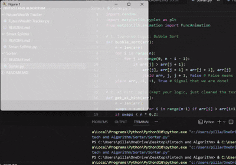

# Sorting Algorithm Visualizer

**Sorting Algorithm Visualizer** is an interactive educational tool designed to bridge the gap between abstract code and visual logic. It allows you to watch exactly how a computer "thinks" as it organizes randomized data into a structured sequence in real-time.
---

### Real-World Application
While we usually don't "see" sorting happening, it is the backbone of almost every digital experience:
* **E-commerce:** When you sort products from "Price: Low to High," an algorithm very similar to this is running behind the scenes.
* **Search Engines:** Google and other databases use advanced versions of these sorts to rank billions of pages by relevance.
* **Database Management:** Sorting is the first step in making data "searchable." It’s much faster to find a name in an alphabetical list than a random one.

---

